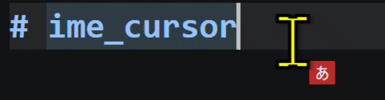

# ime_cursor

マウスカーソルの横に、現在の IME の状態（ひらがな / カタカナ / 英数 など）を小さなバッジで表示する Windows 常駐ツールです。

日本語 IME の状態は画面右下のタスクバーにしか出ないため、視線を大きく動かさないと確認できません。カーソルに追従するバッジを出すことで、入力中の視線のまま状態が分かるようにします。



エディタで日本語入力中の様子。マウスカーソル（Ｉビーム）の右下に「あ」のバッジが追従しています。

## 特徴

- **依存パッケージゼロ** — Python 標準ライブラリ（`ctypes` + `tkinter`）のみ
- **クリックスルー** — バッジの上でも普通にクリックできる（マウス操作を一切邪魔しない）
- **フォーカスを奪わない** — `WS_EX_NOACTIVATE` 指定なので、入力中のアプリのフォーカスは維持される
- **高 DPI 対応** — Per-Monitor v2。複数ディスプレイ・スケーリング混在でも位置がズレない
- **ちらつき防止** — ウィンドウ切り替え中などに IME への問い合わせが一瞬失敗しても、直前の状態を保持する

## 動作環境

| 項目 | 内容 |
| --- | --- |
| OS | Windows 10 / 11 |
| Python | 3.10 以上（tkinter 同梱のもの） |
| 追加インストール | 不要 |

Microsoft Store 版 Python 3.13（tkinter 8.6 同梱）で動作を確認しています。

## 起動

### ダブルクリック

エクスプローラーで **`ime_cursor.pyw`** をダブルクリックするだけです。`.pyw` は `pythonw.exe` に関連付けられているため、コンソール（黒い窓）は表示されません。

### コマンドから

```
pythonw ime_cursor.pyw
```

### 自動起動（ログオン時）

1. `Win+R` → `shell:startup` を開く
2. `ime_cursor.pyw` のショートカットをそのフォルダに置く

## 終了

コンソールを持たない常駐プロセスなので、プロセスを終了させます。プロセスの**コマンドライン**にスクリプトのパスが入っているため、それを条件にこのスクリプトだけを狙って終了できます。

```
powershell -NoProfile -Command "Get-CimInstance Win32_Process | Where-Object { $_.CommandLine -like '*ime_cursor.pyw*' } | ForEach-Object { Stop-Process -Id $_.ProcessId -Force }"
```

他の `.pyw` スクリプトを `pythonw` で常駐させていても、それらは終了しません。

タスクマネージャーから終了する場合は、「詳細」タブで列見出しを右クリック →「列の選択」→「コマンド ライン」にチェックを入れてください。どの `pythonw` がこのスクリプトなのか判別できます。

`taskkill /im pythonw.exe` のようなプロセス名だけの指定は使わないでください。他の `.pyw` スクリプトを巻き添えにするうえ、プロセス名は Python の導入方法によって `pythonw.exe` / `pythonw3.13.exe` と変わるため、そもそも当たらないことがあります。

## 設定

コマンドラインオプションはありません。`ime_cursor.pyw` の冒頭にある **「設定」セクションの定数**を書き換えてください。

| 定数 | 既定値 | 説明 |
| --- | --- | --- |
| `OFFSET_X`, `OFFSET_Y` | `20`, `20` | カーソルからの表示オフセット（px）。負の値にするとカーソルの左上に出せる |
| `INTERVAL_MS` | `30` | 位置と状態の更新間隔（ミリ秒）。小さいほど追従が滑らかで、CPU 使用率は上がる |
| `FONT_SIZE` | `16` | バッジの文字サイズ（px） |
| `PAD_X`, `PAD_Y` | `6`, `1` | バッジ内側の余白（px） |
| `ALPHA` | `0.85` | 不透明度（0.0 = 透明 〜 1.0 = 不透明） |
| `HIDE_ALNUM` | `False` | `True` にすると、半角英数・直接入力のときはバッジを隠す（日本語入力中だけ表示したい場合に） |
| `VERBOSE` | `False` | `True` にすると「あ ひらがな」のように説明も表示する |
| `FONT_CANDIDATES` | 游ゴシック系 | 使用するフォント。先頭から順に探し、見つかったものを使う |
| `PALETTE` | — | IME の状態ごとの（背景色, 文字色） |
| `DEBUG_CONSOLE` | `False` | `True` にすると GUI を出さず、状態をコンソールに出力し続ける（デバッグ用） |

設定を変えたら、起動中のプロセスを終了してから起動し直してください。

### 例: 日本語入力中だけ、大きめに表示する

```python
FONT_SIZE = 22
HIDE_ALNUM = True
```

### 例: カーソルの左上に表示する

```python
OFFSET_X = -60
OFFSET_Y = -30
```

## 表示

| IME の状態 | バッジ | 背景色 |
| --- | --- | --- |
| ひらがな | あ | 赤 |
| 全角カタカナ | カ | 橙 |
| 半角カタカナ | ｶ | 橙 |
| 半角ひらがな | ｱ | 橙 |
| 全角英数 | Ａ | 緑 |
| 半角英数 | A | 灰 |
| 直接入力（IME オフ） | A | 灰 |
| 取得できず | ? | 紫 |

## 仕組み

### IME 状態の取得

1. `GetForegroundWindow` → `GetGUIThreadInfo` で、入力フォーカスを持つウィンドウを特定する
2. `ImmGetDefaultIMEWnd` で、そのウィンドウに対応する IME ウィンドウのハンドルを得る
3. `SendMessageTimeoutW` で `WM_IME_CONTROL` を送る
   - `IMC_GETOPENSTATUS` → IME のオン / オフ
   - `IMC_GETCONVERSIONMODE` → 変換モードのビットフラグ

変換モードのビット（`IME_CMODE_NATIVE` / `KATAKANA` / `FULLSHAPE`）の組み合わせから、ひらがな・カタカナ・全角英数などを判定します。

フォーカス側のウィンドウから取得できない場合は前面ウィンドウにフォールバックし、それでも失敗した場合は直前の状態を最大 8 回分だけ保持します（表示のちらつき防止）。

`SendMessageTimeoutW` に `SMTO_ABORTIFHUNG` とタイムアウト 120ms を指定しているため、応答しないアプリが前面にあってもツールが固まることはありません。

### オーバーレイ表示

tkinter のトップレベルウィンドウに、`SetWindowLongPtrW` で以下の拡張スタイルを付けています。

| スタイル | 目的 |
| --- | --- |
| `WS_EX_LAYERED` | 半透明表示 |
| `WS_EX_TRANSPARENT` | クリックスルー（マウス操作を透過させる） |
| `WS_EX_NOACTIVATE` | クリックされてもフォーカスを奪わない |
| `WS_EX_TOOLWINDOW` | Alt+Tab とタスクバーに出さない |

`INTERVAL_MS` ごとに `GetCursorPos` を読み、`GetSystemMetrics(SM_*VIRTUALSCREEN)` で仮想デスクトップの範囲にクランプしてから移動します。

## デバッグ

`DEBUG_CONSOLE = True` にすると、GUI を出さずに状態遷移だけをコンソールへ出力します。このときは `pythonw` ではなく `python` で起動してください（`pythonw` は `sys.stdout` が `None` になり、`print()` が破棄されるため）。

```
python ime_cursor.pyw
```

```
IME 状態を監視中 (Ctrl+C で終了)
あ  ひらがな     open=1 mode=0x09
A  直接入力     open=0 mode=0x00
```

`mode` は `IMC_GETCONVERSIONMODE` の生の値なので、判定がおかしいときはこの値を見てください。

## トラブルシューティング

**バッジが「?」のまま**
IME ウィンドウが取得できていません。UWP アプリなど IMM32 を経由しない一部のアプリが前面にあると発生することがあります。別のアプリにフォーカスを移すと復帰します。

**ダブルクリックしても何も起きない**
`.pyw` が `pythonw.exe` に関連付けられていない可能性があります。次のコマンドで確認してください。

```
reg query "HKCU\Software\Classes\.pyw"
```

関連付けが無い場合は `pythonw ime_cursor.pyw` で直接起動するか、`pythonw.exe` を指すショートカットを作成してください。

**バッジの位置がカーソルとズレる**
Per-Monitor v2 の DPI 認識に失敗している可能性があります。`OFFSET_X` / `OFFSET_Y` で調整してください。

**多重起動してしまった**
「[終了](#終了)」のコマンドで該当プロセスをすべて終了してから、起動し直してください。

## WSL から使う場合

スクリプトを WSL 側に置いたままでも、UNC パス経由で Windows の `pythonw.exe` から実行できます。

```bash
powershell.exe -NoProfile -Command "Start-Process pythonw -ArgumentList '\\wsl.localhost\<ディストリ名>\<スクリプトのパス>\ime_cursor.pyw'"
```

## 補足

`# /// script` の PEP 723 ヘッダを残してあるため、`uv run ime_cursor.pyw` でも起動できます。ただし `uv.exe` はコンソールアプリのため、ショートカットから起動すると黒い窓が出たままになります。uv を使う場合は、コンソールを持たない `uvw.exe` を利用してください。
